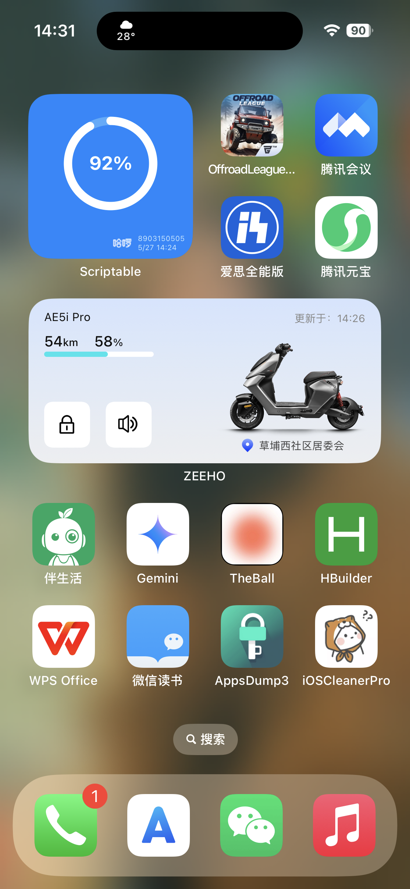
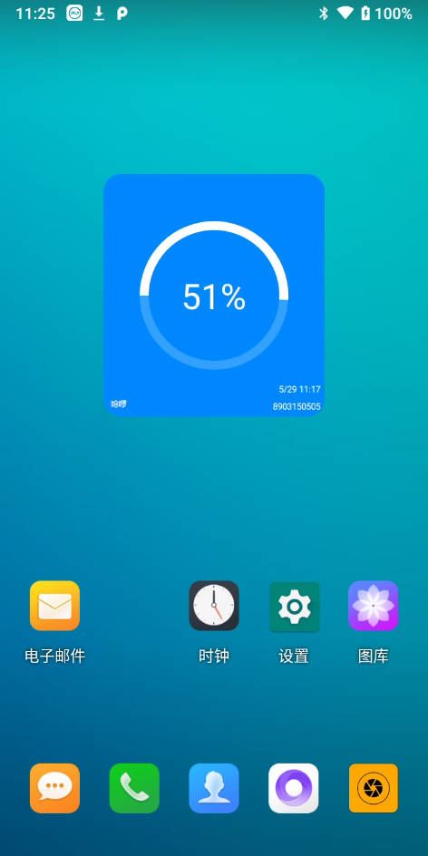
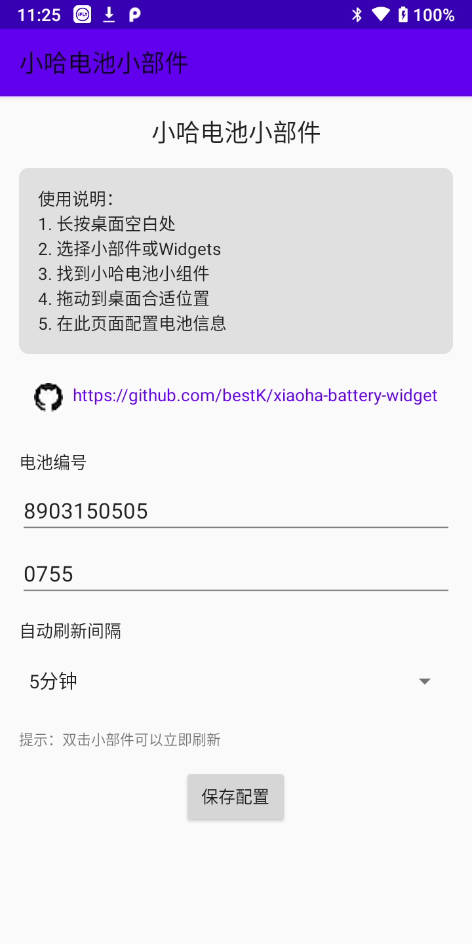

# 小哈电池Widget - 实时电池状态监控

一个跨平台的小哈共享充电宝电池状态监控小组件，支持iOS (Scriptable) 和 Android原生应用。

## 📱 支持平台

- **iOS**: 基于Scriptable的桌面小组件
- **Android**: 原生Android桌面小组件

## ✨ 主要功能

- 🔋 实时显示电池电量百分比
- ⏰ 显示最后更新时间
- 🔄 自动定时刷新
- 📱 精美的环形进度条界面
- 🔍 详细的API调用测试功能
- 📋 测试日志复制和导出

## 🛠️ 必要条件

### 获取Token (重要!)

使用前需要通过抓包获取您的个人Token：

1. **抓包工具推荐**:
   - iOS: Charles、Thor、Surge等
   - Android: Charles、Fiddler、HttpCanary等

2. **抓包步骤**:
   - 配置抓包工具的HTTPS证书
   - 打开小哈租电微信小程序
   - 查看电池详情页面
   - 在抓包工具中找到包含您个人信息的请求
   - 复制该请求的完整Body内容作为Token

3. **Token格式**: 
   - 通常是一段Base64编码的长字符串
   - 包含加密的用户认证信息
   - 每个用户的Token都是唯一的

### 获取电池编号

在小哈租电微信小程序中查看您租借的电池详情，记录电池编号。

## 🚀 使用方式

### iOS版本 (Scriptable)

#### 安装步骤:
1. 从App Store下载 **Scriptable** 应用
2. 复制 `widget.js` 中的代码到Scriptable中
3. 修改代码中的配置参数:
   ```javascript
   const batteryNo = '你的电池编号';
   const token = '你的token';
   ```
4. 在桌面添加Scriptable小组件并选择对应脚本

### Android版本 (原生应用)

#### 安装步骤:
1. 下载Release中的APK文件并安装
2. 长按桌面空白处，选择"小部件/Widgets"
3. 找到"小哈电池小组件"并拖动到桌面
4. 在配置界面输入:
   - **电池编号**: 您的电池编号
   - **Token**: 通过抓包获取的完整Token
   - **城市代码**: 可选，默认为0755(深圳)
   - **刷新间隔**: 选择自动刷新频率

#### 测试功能:
- 点击**"测试接口连接"**验证配置是否正确
- 查看详细的API调用日志
- 复制日志用于问题排查

## 🔄 API执行流程

本应用采用三步API调用流程确保数据安全:

### 步骤1: 获取预处理参数
```
POST https://xiaoha.linkof.link/preparams?batteryNo={电池编号}
Body: {用户Token}
```
**作用**: 使用用户Token和电池编号获取后续请求所需的参数
**返回**: 包含目标URL、加密Body和必要Headers

### 步骤2: 获取电池数据  
```
POST {从步骤1获取的URL}
Headers: {从步骤1获取的认证Headers}
Body: {从步骤1获取的加密Body}
```
**作用**: 向小哈官方API请求加密的电池数据
**返回**: 加密的电池状态信息

### 步骤3: 解码电池数据
```
POST https://xiaoha.linkof.link/decode  
Body: {步骤2返回的加密数据}
```
**作用**: 解码加密数据获取可读的电池信息
**返回**: 包含电池电量、更新时间等信息

## 🛡️ 安全说明

- Token包含您的个人认证信息，请勿分享给他人
- 本应用仅在本地处理数据，不会上传或存储您的个人信息
- 中转服务器仅用于解决跨域问题，不记录任何用户数据

## 📸 界面预览

### iOS版本


### Android版本



## 🔧 技术特性

### iOS版本
- 基于Scriptable JavaScript引擎
- 支持深色/浅色主题自适应
- Canvas绘制的精美进度圆环

### Android版本  
- 原生Kotlin开发
- 现代化Material Design界面
- 协程异步网络请求
- 详细的错误处理和日志记录
- 支持多个小组件实例

## ❓ 常见问题

### Q: 提示"token无效"或"参数错误"
A: 请重新抓包获取最新的Token，确保Token完整且未过期

### Q: Android版本无法添加到桌面
A: 确保已授权应用的"显示在其他应用上层"权限

### Q: 显示"网络错误"
A: 检查网络连接，确认小哈租电服务正常

### Q: 电池信息不更新  
A: 检查电池是否在线，尝试在小哈租电小程序中刷新

## 📄 开源协议

本项目采用 MIT 协议开源，欢迎贡献代码和反馈问题。

## 🤝 贡献

欢迎提交Issues和Pull Requests来改进这个项目！

---

**免责声明**: 本工具仅供个人学习和使用，请遵守小哈租电的服务条款。